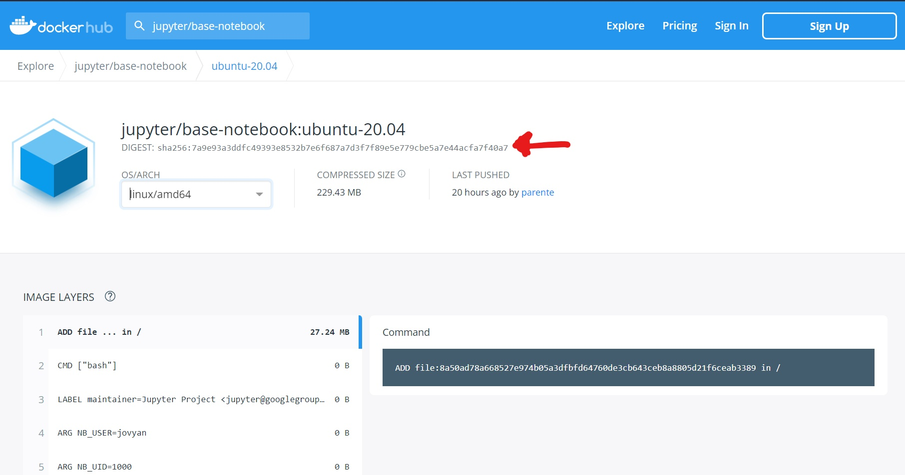

# Guide for the maintenance of pyiron docker stacks

There are a few steps in regular updating pyiron docker images:

- pull this repository
- create a new git branch locally
- updating the hash of the base image in pyiron/base image.
- updating the environment.yml file for each of the images
- push the changes to github
- Check the result of the each github workflows
- resolving conflicting conda packages
- In case of failling notebook, reporting issues with pyiron packages in their corresponding repositories

Below you can find details about some of the above steps.

## updating hash of the base image
Currently, we use as the base image, `jupyter/base-notebook:ubuntu-20.04`. This image is regularly updated. Since the tag is not changed each time. We change the hash of the image. The hash of the image is given as `sha256:2d09745c7212907cf003e369921a935a055a92986acd47da90f22b8befd815fc`. To get the latest hash for the aformentioned image, you can browse to https://hub.docker.com, and search for `jupyter/base-notebook`. After selecting the found image, click on the tags and look for `ubuntu20.04`. Change the `OS/ARCH` to `linux/amd64` then copy the digest which is written blow the image name (image below).



## updating conda environment files

To update the environment files, you need to go to each directory (`base`, `md`, `pyiron`, `continuum`, `potential`, `experimental`), and edit the file `environment.yml`. In each `environment.yml`, you find a list of conda packages which are installed in the the corresponding images. To update each conda package, you need to search in `anaconda.org` for each package, and find the latest version, then simply insert the latest version in front of the package name (after the equal sign).

## resolving conflicting conda packages
This is a complicated step of the process. First, please look into the issue section of this repository to know if there is a report of some conflicting packages. The second approach is to build the docker images locally and figuring out which two (or more) packages have conflict with each other. Then you should try to find versions of the packages, which are compatible with each other.
To build docker images locally, you should make sure that the Base image in the docker file has been already built on your system; for example, if you want to build pyiron/md image, you should first build pyiron/base latest image, otherwise docker downloads the latest version available on hub.docker.com . The command to build an image is:
```
docker build -t pyiron/base:latest .
```
Instead of `base`, you can replace `md`, `continuum`, etc.

## Reporting failing notebooks
When you update images, during the pull request, there will be two testing steps. In first step, the build of the images are tested, during which you can see if the conda packages are installed correctly or not. 
In the second step, inside each image, some relevant pyiron notebooks are tested, to see whether the images are able to run required notebooks.

If you noticed failing notebooks, you should open issue on the relavant pyiron repository. For example, when a notebook failed in `md`, or `pyiron` image, you should report it in `pyiron_atomistics`. 

## Extra comments
In case of some questions, for which you could not find answer here, you can contact the previous maintainers via issues on this repository and tagging them.